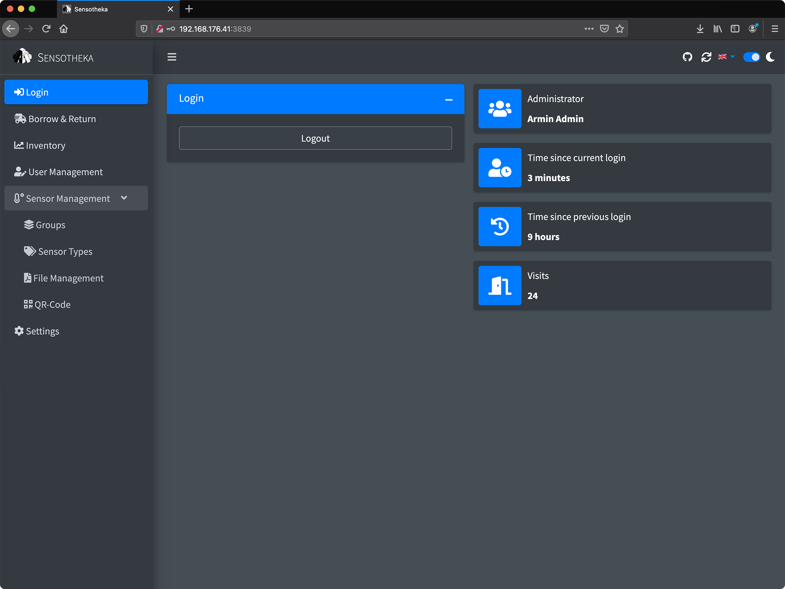
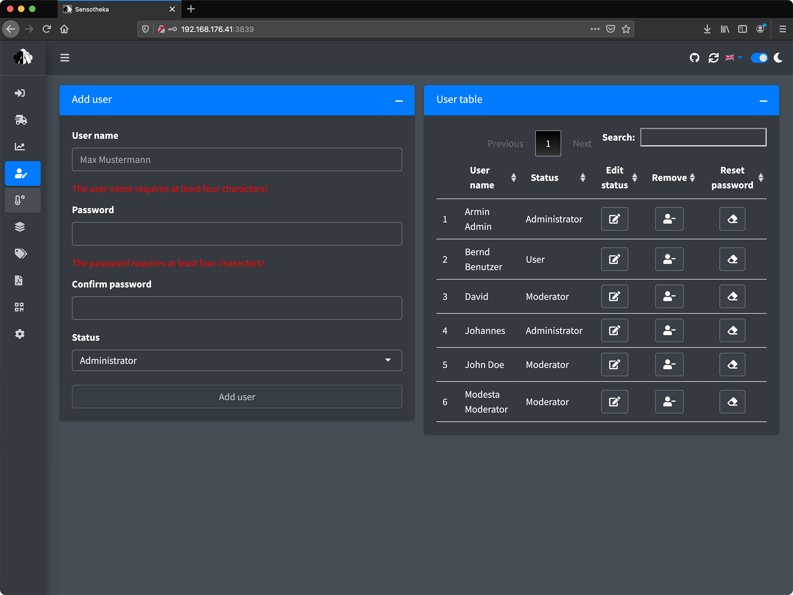
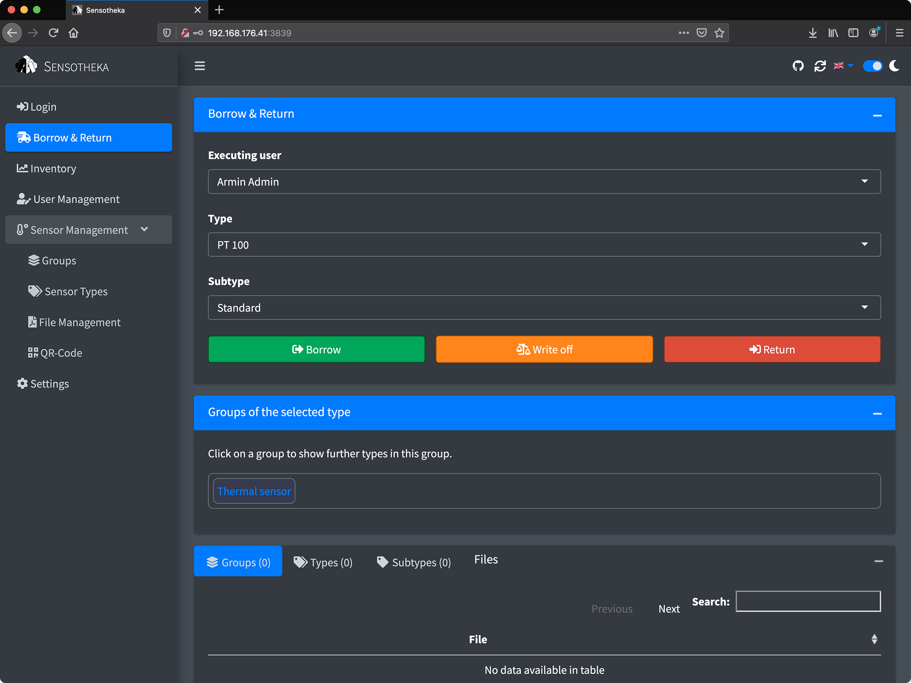
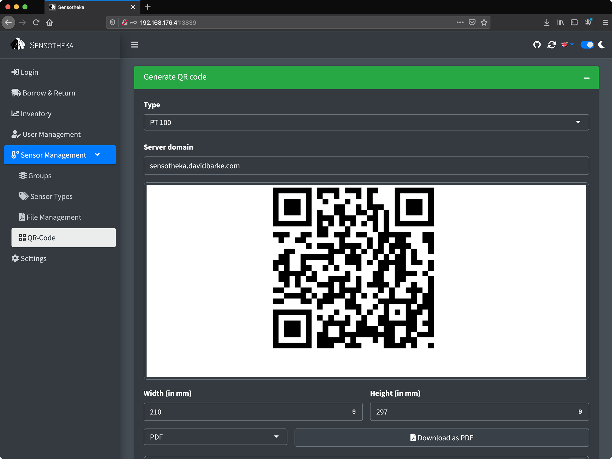
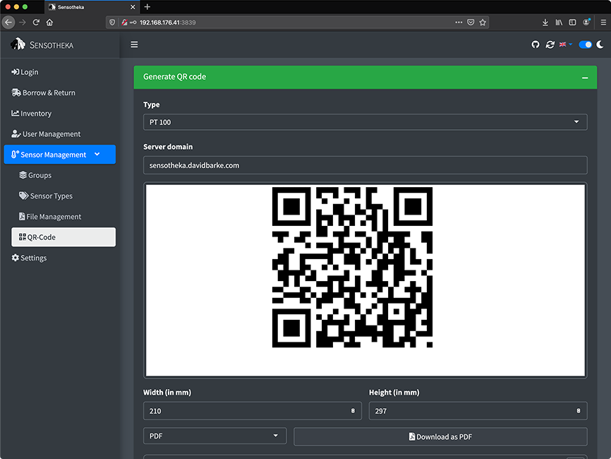

<!-- README.md is generated from README.Rmd. Please edit that file -->

```{r, include = FALSE}
knitr::opts_chunk$set(
  collapse = TRUE,
  comment = "#>"
)
```

# PFA

<!-- badges: start -->
<!-- badges: end -->

# App Title

Sensotheka - Management of Inventory, Files & Users

## Authors

David Barkemeyer, Johannes Hendrik Lutz Sturm

## Usernames

David_Barkemeyer

## Keywords

stock-management, user-management, file-management, internationalization, database-integration

## Category

Other

## URL of deployed app

https://davidbarke.shinyapps.io/Sensotheka/

## URL of source code

https://github.com/PFA-WebApp/App

## URL of RStudio Cloud project with app

https://rstudio.cloud/project/2495352

## Short Description

Sensotheka supports the Department of Vehicle Propulsion Systems at the TU Berlin in managing its sensors. A SQLite database manages users, sensors and transactions. Sensors can be borrowed and returned via QR codes.

## Long description

### Contents

1. Background
1. User Management
1. Sensor Management
1. File Management
1. QR Codes
1. Internationalization
1. Cookies

### 1. Background

Every semester, the Department of Vehicle Propulsion Systems at TU Berlin offers the so-called "Propulsion Systems Project", in which students can work on one of the department's various projects. In the winter semester 2020/21, the development of a web application to manage the sensors of the department was tendered. Since no particular framework was given and Johannes and I both have some experience working with Shiny, we decided to take on this project and develop the Shiny application presented here.
 
### 2. User Management

There are three different user roles: *User*, *Moderator* and *Administrator*. Depending on the user role, different tabs are visible in the sidebar and many operations differ depending on the user role.For example, an *Administrator* can borrow and return sensors for any user, while a *User* can only perform transactions for themselves. 




 
### 3. Sensor Management

Relationships between sensors are mapped using a three-part hierarchy. A given sensor is a *Subtype*. *Subtypes* that have the same functionality but differ in size or manufacturer are all part of the same *Type*. *Types* that form an experimental setup can be grouped into a *Group*. *Administrators* can add, modify, and remove entities at any level of the introduced hierarchy.



### 4. File Management

*Administrators* can upload PDF files for each step of the hierarchy. These are all stored in separate subdirectories of the 'files' directory. All users can then download these files. File contents are e.g. data sheets for specific sensors or theoretical backgrounds for experimental setups.


### 5. QR Codes

*Administrators* can create QR codes for *Types*. These QR codes are printed and stored in the sensor warehouse. If a user scans one of them with a QR reader, they will be redirected to the *Borrowing & Returning* tab and the scanned *Type* will already be selected. For this functionality, the query string of the URL is processed.



### 6. Internationalization

The user interface of the application we developed for the project was exclusively in German. For our contribution to the contest, we decided to internationalize all the code and localize it in English, Spanish and French - languages that we or friends of ours know and whose grammatical structure has similarities with German. We first tried the {shiny.i18n} package, but missed some features like interpolation and parameterized keys, so we decided to build our own {i18n} package that takes some ideas from the above package and develops them further. The language selector in the upper right corner allows a quick and live language change.

### 7. Cookies

There are two cookies that store client data:

* `user`: the encrypted username so that a user can be logged in automatically as long as this cookie does not expire.
* `dark-mode`: The dark mode setting, so that the dark mode is set accordingly when the application is started.

## Thumbnail Image


## Screenshot of app (large)


